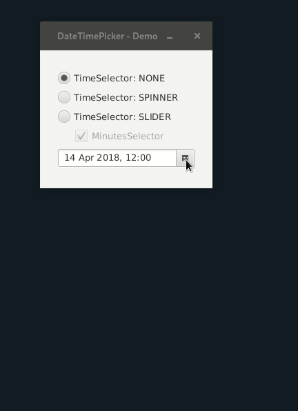

[](https://circleci.com/gh/hemeroc/javafx-datetimepicker)

# DateTimePicker for JavaFX9+

The DateTimePicker for JavaFX9+ is an extended version of the JavaFX9 DatePicker
which adds the possibility to also select a time.\
The component tries to mimic the original JavaFX9 design as close as possible.
It also provides multiple ways of selecting time by using `Spinners` as well as `Sliders`
with and without the possibility to select minutes separately,

## License

This project is licensed under the [Apache License 2.0](LICENSE).

## Demo



## Contribution

Feel free to contribute via github pull requests or by providing github issue reports if you face any.

## Usage

As this project is still in `BETA` stage only snapshot releases are available via jitpack.

### Add the jitpack maven repository

```xml
<repositories>
    <repository>
        <id>jitpack.io</id>
        <url>https://jitpack.io</url>
    </repository>
</repositories>
```

### Add the maven dependency

```xml
<dependency>
    <groupId>com.github.hemeroc</groupId>
    <artifactId>javafx-datetimepicker</artifactId>
    <version>master-SNAPSHOT</version>
</dependency>
```

### Write some sample code

```java
import io.github.hemeroc.javafx.datetimepicker.DateTimePicker;
import javafx.application.Application;
import javafx.geometry.Insets;
import javafx.scene.Scene;
import javafx.scene.control.CheckBox;
import javafx.scene.control.RadioButton;
import javafx.scene.control.ToggleGroup;
import javafx.scene.layout.HBox;
import javafx.scene.layout.VBox;
import javafx.stage.Stage;

import static javafx.geometry.Pos.CENTER;
import static javafx.geometry.Pos.CENTER_LEFT;

public class DateTimePickerDemo extends Application {

    public void start(Stage stage) {
        DateTimePicker dateTimePicker = new DateTimePicker();
        ToggleGroup group = new ToggleGroup();
        RadioButton radioButtonNone = buildRadioButton(group, DateTimePicker.TimeSelector.NONE);
        RadioButton radioButtonSpinner = buildRadioButton(group, DateTimePicker.TimeSelector.SPINNER);
        RadioButton radioButtonSlider = buildRadioButton(group, DateTimePicker.TimeSelector.SLIDER);
        CheckBox checkBoxMinutes = new CheckBox("MinutesSelector");
        checkBoxMinutes.disableProperty().setValue(true);
        checkBoxMinutes.setPadding(new Insets(0, 0, 0, 25));
        checkBoxMinutes.selectedProperty().bindBidirectional(dateTimePicker.minutesSelectorProperty());
        radioButtonNone.selectedProperty().bindBidirectional(checkBoxMinutes.disableProperty());

        group.selectedToggleProperty().addListener((observable, oldValue, newValue) ->
                dateTimePicker.setTimeSelector((DateTimePicker.TimeSelector) newValue.getUserData()));

        VBox vBox = new VBox(
                radioButtonNone,
                radioButtonSpinner,
                radioButtonSlider,
                checkBoxMinutes,
                dateTimePicker
        );
        vBox.setSpacing(10);
        vBox.setAlignment(CENTER_LEFT);
        HBox hBox = new HBox(vBox);
        hBox.setAlignment(CENTER);

        stage.setTitle("DateTimePicker - Demo");
        stage.setResizable(false);
        stage.setScene(new Scene(hBox, 250, 200));
        stage.centerOnScreen();
        stage.show();
        stage.toFront();
    }

    private RadioButton buildRadioButton(ToggleGroup group, DateTimePicker.TimeSelector timeSelector) {
        RadioButton radioButton = new RadioButton("TimeSelector: " + timeSelector.name());
        radioButton.setToggleGroup(group);
        radioButton.setUserData(timeSelector);
        return radioButton;
    }

    public static void main(String[] args) {
        launch(args);
    }
}
```